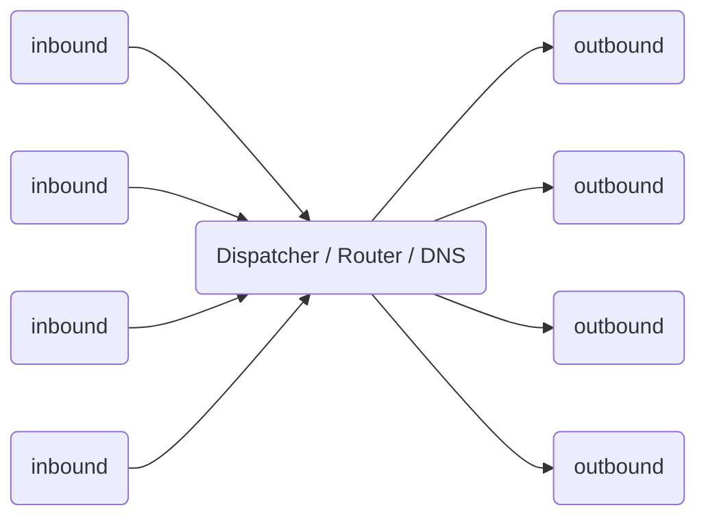

# Working Mechanism

## Single server mode

Like other network proxy tools, you need a server configured with V2Ray, and then install and configure the V2Ray client on your device, and then you can smoothly access the Internet.

```mermaid
graph LR;
A(PC) -.- B(Firewall);
B -.-> C (off-wall website);
A --> D(V2Ray/VPS);
D --> C;
A --> E (in-wall website);
```

A V2Ray server can simultaneously support multiple devices to access using different proxy protocols. At the same time, after reasonable configuration, V2Ray can identify and distinguish between the traffic that needs a proxy and the traffic that does not require a proxy. Directly connected traffic does not require detours.

## Bridge mode

If you don't want to configure routing on every device, you can also set up a transit server to receive all the traffic sent by the client, and then forward the judgment in the server.

```mermaid
graph LR;
A(PC) -.-> B(Firewall);
B -.-> C (off-wall website);
A --> D (VPS in the wall);
D --> E (VPS outside the wall);
E --> C;
D --> F (in-wall website);
```

## working principle

Before configuring V2Ray, let’s take a look at the working principle of V2Ray. The following is a schematic diagram of the internal structure of a single V2Ray process. Multiple V2Rays are independent of each other and do not affect each other.



* You need to configure at least one inbound protocol (Inbound) and one outbound protocol (Outbound) to work properly.
  * The inbound protocol is responsible for communicating with the client (such as a browser):
    * Inbound protocols can usually configure user authentication, such as ID and password;
    * After the inbound protocol receives the data, it will be handed over to the Dispatcher for distribution;
  * The outbound protocol is responsible for sending data to the server, such as V2Ray on another host.
* When there are multiple outbound protocols, routing can be configured to specify that a certain type of traffic is sent by a certain outbound protocol.
  * When necessary, the router will query the DNS for more information to make a judgment.

The specific configuration format is detailed in [Chapter 2](../config/overview.md).
